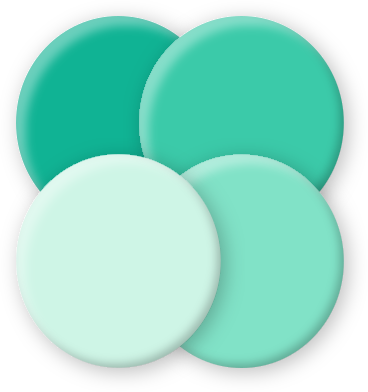

<div align="center">
  

### 폼봐 (formbwa)

---

웹캠이 내 자세를 실시간으로 봐주는 홈 트레이닝 코치

[](https://github.com/xmun74/formbwa/actions/workflows/ci.yml)

🔗 **서비스**: <https://formbwa.site> &nbsp;|&nbsp; 🎨 **디자인 시스템**: <https://ds.formbwa.site>

</div>

---

## 1. 소개

캐릭터 코치의 시범을 따라 하면, **웹캠이 자세를 실시간으로 읽어 그 순간 교정**해주는 홈 트레이닝 서비스. 유튜브 홈트처럼 보되, 그 영상이 나를 마주 보고 자세를 잡아준다.

- 타깃: 홈트 입문자(20~30대)
- 한국어 전용, 데스크톱 우선, **영상은 기기 안에서만 처리(저장, 전송 없음)**
- 1단계는 **스쿼트**부터. 포즈 인식은 온디바이스(MediaPipe)

## 2. 폴더 구조

```
formbwa/
├── apps/
│   ├── web/   # Next.js 프론트엔드 (App Router, FSD)
│   └── be/    # NestJS 백엔드 (Prisma, Postgres)
├── packages/
│   ├── core/              # 판정 엔진 — 프레임워크 무관 순수 TS
│   ├── ui/                # 디자인 시스템 — 컴포넌트 + Storybook
│   ├── design-tokens/     # 디자인 토큰 — TS → Tailwind @theme
│   ├── eslint-config/     # 공유 ESLint 설정
│   └── typescript-config/ # 공유 tsconfig
└── docs/      # PRD, TRD-FE, TRD-BE, TASKS
```

## 3. 기술 스택

| 영역          | 핵심                                                 | 상세                                  |
| ------------- | ---------------------------------------------------- | ------------------------------------- |
| **Frontend**  | Next.js(App Router), Tailwind v4, MediaPipe          | [apps/web/README](apps/web/README.md) |
| **Backend**   | NestJS, Prisma, Postgres                             | [apps/be/README](apps/be/README.md)   |
| 판정 엔진     | `@repo/core` (순수 TS, 웹↔RN 재사용)                 | —                                     |
| 디자인 시스템 | `@repo/ui` (tailwind-variants) + Storybook           | <https://ds.formbwa.site>             |
| 디자인 토큰   | `@repo/design-tokens` (TS → Tailwind theme)          | —                                     |
| 모노레포, 툴  | Turborepo, pnpm, TypeScript, ESLint/Prettier, Vitest | —                                     |

## 4. Frontend — `apps/web`

- Next.js App Router 기반 웹 클라이언트.
- 카메라, 포즈 추론, 판정, 화면을 담당한다.
- FSD(Feature-Sliced Design) 구조.
- 상세 설계: [TRD-FE](docs/TRD-FE.md) | 실행/명령어: [apps/web/README](apps/web/README.md)

## 5. Backend — `apps/be`

- NestJS + Prisma 기반 API 서버
- 계정, 기록, 리포트(2단계).
- 현재는 헬스체크 + 스키마 골격.
- 상세 설계: [TRD-BE](docs/TRD-BE.md) | 실행/명령어: [apps/be/README](apps/be/README.md)

## 6. Packages

| 패키지                    | 역할                                                                                                                     |
| ------------------------- | ------------------------------------------------------------------------------------------------------------------------ |
| `@repo/core`              | 각도, FSM, 판정 로직. React/DOM 무의존 순수 TS(웹→RN 재사용). Vitest 회귀                                                |
| `@repo/ui`                | 디자인 시스템 컴포넌트. tailwind-variants + `cn`, 자립 Storybook, 테스트. 규약 [CONVENTIONS](packages/ui/CONVENTIONS.md) |
| `@repo/design-tokens`     | 색, 간격, 타이포, radius → Tailwind `@theme` 생성                                                                        |
| `@repo/eslint-config`     | base/next-js/react/core/nest/fsd ESLint 프리셋                                                                           |
| `@repo/typescript-config` | 공유 `tsconfig` 베이스                                                                                                   |

## 7. 시작하기

```sh
# 요구사항: Node 20+, pnpm 9
pnpm install

pnpm dev                    # 전체 개발 서버 (web:3000, be:4000)
pnpm --filter web dev       # 프론트만
pnpm --filter be start:dev  # 백엔드만 (Postgres 필요: docker compose up -d)
pnpm storybook              # 디자인 시스템 (localhost:6006)

pnpm build                  # 전체 빌드
pnpm lint                   # 린트
pnpm check-types            # 타입 체크
turbo run test              # 테스트
```

## 8. 문서

- [PRD](docs/PRD.md) — 기획 명세서
- [TRD-FE](docs/TRD-FE.md) — 프론트엔드 기술 설계
- [TRD-BE](docs/TRD-BE.md) — 백엔드 기술 설계
- [TASKS](docs/TASKS.md) — 작업 진행 순서 계획
